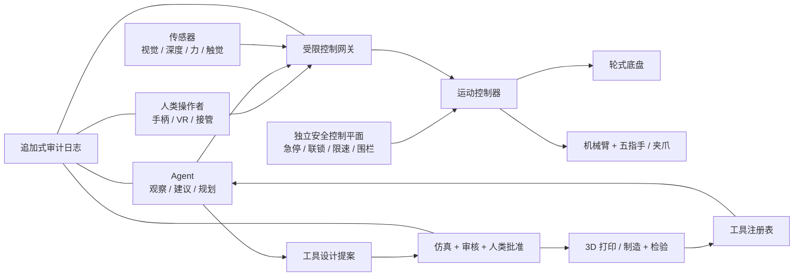

# 三清机匠 / Sanqing Fabricator

> 让机器人先成为人的分身，再成为 Agent 的身体。

一台带轮子的五指机械臂，经由手柄接受人类遥操作，与 Agent 无线协作，观察生产环境、理解任务、选择工具；在更远的未来，它还可以提出新工具设计，经验证后现场 3D 打印，再用新工具完成工作。

**当前状态：`CONCEPT` · `RESEARCH_ONLY` · 能力等级 `L0`。** 本仓库目前只有公开提案和接口草案，没有实体样机、生产验证、经验结果或设备操作授权。

**English abstract.** Sanqing Fabricator is an open concept for a wheeled, five-finger robotic manipulator that begins as a human-operated remote body, learns from consented physical demonstrations, collaborates with Agents through a constrained interface, and may eventually select or propose locally fabricated tools. It is a staged research direction—not a claim that a workerless factory already exists.

## 一句话愿景

人类先借给机器双手，机器把经验整理成技能；Agent 帮它理解任务和寻找工具；制造设备再帮助它获得新的工具。

我们把这条远期闭环称作“一气化三清”：

1. 同一份现场数据形成对环境的**理解**；
2. 同一份理解被 Agent 转化为任务与工具的**计划**；
3. 同一份计划通过机器身体和制造设备成为物理世界里的**行动**。

这是方向图，不是交付日期。所谓“无人车间”只是一项需要长期、安全、公开验证的研究问题。

## 三项核心价值

### 1. 减少高负荷体力劳动，并检验完整经济价值

项目优先探索搬运、取放、分拣、巡检等重复、伤身或环境不友好的工作。机器人先承担“力”和“距离”，人类保留判断、例外处理与安全控制。在美国等高工资市场，这类系统的经济性尤其值得优先检验；但我们不会把表面时薪当作全部成本，也不会预设检验结果必然为正。

```text
单位合格任务总成本 =
  人工操作 + 人工监督 + 设备折旧 + 集成与换线
  + 能耗耗材 + 维护停机 + 质量损失 + 安全合规
```

真正要衡量的是人的高负荷动作暴露、每个合格任务需要的人工分钟、完整单位成本、返工率、停机时间，以及被释放的工时是否转向更安全、更高技能的工作。

### 2. 在少子化与劳动力短缺下增强生产韧性

少子化、老龄化、招工困难和技术岗位短缺在不同地区并不相同，因此这是要用当地数据检验的部署假设，不是全球统一成立的口号。

大型公司可以把它作为柔性产能和降本增效的候选方案；中小企业、合作社、维修作坊、学校和个人开发者也应该能参与。项目因此坚持模块化硬件、普通手柄入口、厂商中立接口、公开 BOM 与集成工时，以及可以从单底盘、单臂、标准夹爪逐步起步的实现路线。

劳动转型也是系统设计的一部分。机器人操作、维护、安全审核、任务设计、工具设计和现场知识标注应成为明确的新角色，而不是把“去掉多少人”当作唯一成绩。

### 3. 为 AI 建立经授权的真实世界物理数据闭环

语言和图片不能完整表达力、摩擦、遮挡、接触、工具约束、失败恢复，以及一个动作造成的后果。人类遥操作与受监督执行可以产生时间同步的物理轨迹：

- 操作者输入与接管；
- RGB、深度、关节、底盘、触觉和力信号；
- 工具的几何、材料、载荷与身份；
- 任务前后的环境变化；
- 成功、失败、险情、停止与恢复原因。

这些轨迹可用于研究 AI 原生世界模型：不只识别“眼前是什么”，还预测“如果这样行动，接下来可能发生什么”。但生产现场不是免费的数据矿。场地、操作者和相关人员必须知情同意；用途、访问范围、留存期限、训练权限和撤回机制必须明确；工厂机密、客户信息、无关人脸与语音默认不得公开。

## 核心设计

三清机匠不是一台万能机器人，而是一组可替换、可审计、逐级放权的模块。



关键边界：**Agent 不能直接写电机、打印机或机床控制寄存器。** 它只能提交提案，或调用已经授权且受安全包络约束的技能。安全控制平面独立于 Agent，拥有最终否决权。

### 六个逻辑层

1. **移动与操作**：轮式底盘、机械臂、五指手或低成本夹爪、快换末端接口。
2. **人类遥操作**：手柄起步，可扩展 VR、动作捕捉和力反馈；支持录制、回放和随时接管。
3. **环境感知**：多视角视觉、深度、力矩、触觉、接近、定位和传感器健康度。
4. **Agent 协作**：理解任务、拆解步骤、检索技能与工具、提出方案、解释不确定性。
5. **工具与数字制造**：工具注册、参数化设计、仿真、切片、打印、检验、低能量测试和版本控制。
6. **安全与审计**：硬件急停、能量隔离、速度/力/空间限制、权限、加密通信和可回放日志。

## 从“人的分身”到“受限自治”

| 等级 | 名称 | Agent 能做什么 | 物理边界 |
| --- | --- | --- | --- |
| L0 | 概念与仿真 | 阅读规范、生成提案、运行合成测试 | 不连接真实执行器 |
| L1 | 人类遥操作 | 观察、记录、解释 | 人类手柄控制，安全控制持续生效 |
| L2 | 影子/顾问模式 | 推荐步骤、路径和工具 | 建议不自动进入执行链 |
| L3 | 监督式有限自治 | 调用预批准技能 | 限任务、工具、区域、速度、载荷和时限；人类监督 |
| L4 | 封闭单元自治 | 调度已验证技能 | 隔离生产单元；工具和技能均已批准 |
| L5 | 开放世界自治 | **本项目不支持** | 自定目标、与人员混行、绕过联锁或自主晋级均禁止 |

能力等级不能因为模型升级、成功次数或运行时间自动提升。`supported_level` 与 `authorized_level` 同时存在，部署只能取二者较低值。

## 第一版 MVP：先闭合最短、最安全的环

第一版不追求“五指万能工人”，而验证一个可复现的低风险闭环：

> 人用普通手柄遥控带轮底盘和机械臂，在封闭测试区完成轻质物体取放；系统同步记录视频、传感器、控制输入、工具身份与结果；Agent 只能生成任务摘要和下一次建议，不能自行驱动物理设备。

MVP 至少包含：

- 本地双通道硬件急停与授权人类现场复位；
- 无线失联后确定性进入安全状态，禁止自动续作；
- 底盘限速、机械臂速度/力限制和地理围栏；
- 标准夹爪优先，五指手作为可替换研究模块；
- 操作者、Agent、安全控制器和实际执行命令分别记录；
- 所有例子使用轻质、无尖锐边缘的测试物；
- 每次动作都能回答：谁提出、谁批准、用何工具、依据何在、结果如何。

MVP 的成功不是“看起来像人”，而是：可追踪、可停机、可接管、可回放、可替换、可复现。

## 现场造工具，但不能现场跳过验证

当已有工具不合适时，Agent 可以提出夹具、适配器或柔性末端工具设计，但不能批准自己的设计。候选工具必须按顺序经过：

```text
PROPOSED → DESIGN_LOCKED → STATIC_CHECKED → SIMULATION_PASSED
→ HAZARD_REVIEWED → HUMAN_APPROVED → FABRICATED → INSPECTED
→ REGISTERED → LOW_ENERGY_TESTED → AUTHORIZED
```

任一步失败都进入 `REJECTED` 或 `QUARANTINED`。CAD、材料、切片参数、打印机配置或模型版本变化，就必须产生新版本和新哈希，旧批准自动失效。仿真通过不等于制造授权，打印完成也不等于使用授权。

## 把宏大愿景变成可证伪假设

以下是首轮研究靶标，不是已经取得的成绩。每个试点必须先登记基线、周期、成本口径和失败条件。

| 假设 | 首轮验证方法 | 建议指标 |
| --- | --- | --- |
| H1：减少体力负担 | 同一低风险任务做纯人工与人机协作对照 | 高负荷动作暴露时间减少至少 30%；合格率不低于基线；零次绕过安全控制 |
| H2：产生经济价值 | 计入采购、集成、监督、维护、停机和耗材 | 单位合格任务总成本下降至少 15%，或在公开假设下预计回收期不超过 36 个月 |
| H3：缓解缺工 | 统计原本无人承担或依赖加班的任务 | 覆盖至少 20% 未满足任务工时；不增加员工总加班；异常可交还给人 |
| H4：非巨头也能复现 | 由无专职机器人团队的参与者部署 | 基准任务无需修改核心协议即可完成；安装、培训与换线工时全部公开 |
| H5：物理数据改善模型 | 比较使用与不使用授权轨迹的模型，在陌生布局测试 | 授权与来源覆盖率 100%；关键流时间同步完整率至少 99%；任务成功率提高或接管率下降至少 20% |
| H6：系统知道何时不行动 | 注入遮挡、未知工具、失联、传感器冲突和越权指令 | 预定义危险条件安全停止率 100%；未批准工具真实执行为 0；失联后确定性停机 |

这些数字是可讨论的首轮阈值。若系统减少了直接操作时间，却增加了维护、监督、返工或员工风险，就不能宣称“降本增效”；若模型只在训练布局中进步，却不能在陌生环境安全降级，也不能宣称获得了通用世界模型能力。

## 路线图

### Phase 0：公开规范与仿真

发布机器可读任务、工具、消息与审计格式；建立合成测试、威胁模型和纯仿真取放示例。

### Phase 1：人类遥操作原型

手柄控制底盘、机械臂与夹爪；实现多视角回传、数据录制、硬件急停、限速、围栏与失联保护。

### Phase 2：受监督的技能学习

从经授权的人类示范中切分步骤，在仿真和封闭测试区验证重复技能；真实执行须逐次或按明确范围批准。

### Phase 3：环境理解与工具推荐

建立语义地图，根据材料、载荷、空间和任务推荐已有工具；没有合适工具时停止并提出需求，不强行操作。

### Phase 4：受控工具生成

从参数化模板生成候选夹具，经静态检查、仿真、危害评审、人类批准、打印、检验和低能量测试后进入白名单。

### Phase 5：多单元协作实验

在隔离、低风险、结构化场景中研究多机器人任务分配与经验共享；安全控制仍在每个单元本地独立运行。

## 不可妥协的边界

- 安全控制权留在本地；无线软件停止不能替代硬件急停。
- 默认拒绝、失败关闭；缺授权、身份、时间、传感器新鲜度或工具哈希时不执行。
- 人员检测缺失不能被解释为“现场无人”。
- 急停只能由授权人类在现场检查后复位，通信恢复不得自动续作。
- Agent 不得修改安全边界、提升自治等级、批准自己的工具或把建议伪装成授权。
- 机床、打印机和重型设备保留自己的安全联锁与独立许可。
- 未经同意的劳动数据不采集、不训练、不公开；生产数据不因操作机器人而自动归模型或平台所有。
- 不支持武器、伤害、胁迫或未经同意的人员监控用途。
- 演示、模拟和合成数据必须明确标记，不能被描述为实体生产能力。

更完整的危害、停止条件和验证门槛见 [`SAFETY.md`](SAFETY.md)。

## 为人类和 Agent 同时写作

| 文件 | 用途 |
| --- | --- |
| [`README.md`](README.md) | 人类入口：愿景、价值、架构和路线图 |
| [`llms.txt`](llms.txt) | Agent/爬虫的最短读取入口 |
| [`agent-manifest.json`](agent-manifest.json) | 当前状态、价值假设、能力等级和安全不变量 |
| [`AGENTS.md`](AGENTS.md) | Agent 操作契约与禁止事项 |
| [`spec/README.md`](spec/README.md) | 规范性接口、状态机和工具生命周期 |
| [`spec/*.schema.json`](spec/) | 消息、任务和工具的 JSON Schema |
| [`SAFETY.md`](SAFETY.md) | 人类可读安全模型和晋级门槛 |
| [`CONTRIBUTING.md`](CONTRIBUTING.md) | 贡献入口与证据要求 |

机器文件使用 UTF-8、英文稳定字段名、ISO 8601 UTC 时间、SI 单位、显式坐标系和 SemVer。机器入口刻意重复当前真实性状态，防止 Agent 把路线图误读成已实现能力。

## 现在希望社区贡献什么

- 仿真场景、合成测试和 hostile tests；
- 厂商中立的任务、技能、工具与审计 Schema；
- 普通手柄、无障碍遥操作和数据回放界面；
- 低成本底盘、传感器、夹爪与五指手方案比较；
- 参数化夹具、工具适配器和检验流程；
- 数据同意、隐私、劳动转型和成本模型；
- 安全状态机、威胁模型、故障注入和独立评审；
- 文档、翻译、教学材料与批判性反例。

每项贡献必须标注适用的证据级别：`SYNTHETIC`、`SIMULATION_ONLY`、`HUMAN_CONTROLLED`、`SUPERVISED_AUTONOMY`、`HARDWARE_VALIDATED` 或 `PRODUCTION_VALIDATED`。较高标签必须附带可审查证据，不能靠描述自行升级。

## 最后的画面

如果这条路线成立，未来的生产单元可能只需要 AI、原材料、机器人身体和经过安全集成的机床等重型设备，就能把“理解—规划—行动—验证—再学习”连成一条持续演进的链。

但真正值得追求的，不只是“没有工人的车间”。更好的目标是：**人的身体负担下降了，组织的完整成本改善了，稀缺劳动力被用于更需要判断的地方，AI 获得真实世界经验的过程也尊重了数据提供者。**

这就是三清机匠的“一气化三清”：不是神话式的一步登天，而是让同一份智能，在理解、规划与行动之间不断流转，并且知道何时该停下、何时该请求帮助。

## License

This concept paper and its original schemas are dedicated to the public domain under the repository's [CC0 1.0 Universal](../../LICENSE), unless an individual file states otherwise. This does not license third-party components, future datasets, models, patents, trademarks, or hardware implementations.
